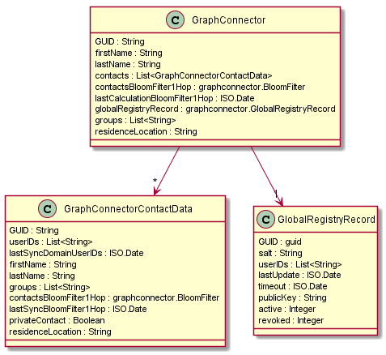

# Graph Connector
The Graph Connector can generate GUIDs and re-use previously generated GUIDs.
Furthermore, it handles contacts of a user and thus serves as a address book or contact list.
In order to not be bound to previously known contacts, the Graph Connector can contact the Global Registry
to resolve unknown GUIDs.

## User View
From a user's perspective, the Graph Connector offers the possibility to generate a GUID and present a 16 word string.
With this string, the user can re-generate her key pair on any future occasion.
The Graph Connector enables the user to store her contacts and query the Global Registry about yet unknown contacts.

## Developer View
Here, we will describe the technologies used within the Graph Connector, its data model and interfaces.

**Mnemonics for GUID generation**:
Utilizing Elliptic Curve Cryptography with Bitcoin libraries,
we can deterministically generate a ECDSA key pair over curve secp256k1 from a list of words from a given
dictionary of English words.
Calling "generateGUID()" will create a random mnemonic, create a key pair out of it and will return the mnemonic.
The mnemonic consisting of 16 words is all the user needs to re-use the same GUID on any other device.

**Bloom filter**:
For each contact, we store information about the contact's contacts.
To preserve privacy and to reduce the amount of data that needs to be transferred,
we utilize Bloom filters, a probabilistic data structure for testing set membership.
A Bloom filter consists of a bit array, initialized with all "0"s, and hash functions.
Each element that is entered into the Bloom filter is hashed by the hash functions.
The hash functions return positions in the bit array. These positions are changed to "1."
In order to test set membership, the hash functions are applied on the given value
and the returned positions checked if they are "1."
There can be false positives but no false negatives.
With increasing size of the bit array, the probability of false positives can be reduced.
For the Bloom filter in the Graph Connector, we assumed an average of 300 contacts (roughly
the size of the average amount of Facebook friends, see for example 
http://www.statista.com/statistics/232499/americans-who-use-social-networking-sites-several-times-per-day/ and
http://techland.time.com/2012/02/03/on-facebook-friends-of-friends-could-mean-hundreds-of-thousands/)
and chose a size of the Bloom filter that results in a false positive rate of 0.1 percent.
In the Bloom filters, users are identified by their GUID.
The information stored in the Bloom filter with each contact can be used to feed a trust engine.
We can indicate how many mutual contacts an incoming caller has with the user.
This information can indicate, e.g., that an incoming call might be trustworthy because
the user has multiple mutual contacts with the caller.

**JWT**:
Utilizing JSON Web Tokens, we can ensure the validity of the data that is send to and stored in the
Global Registry.

**Communication between Graph Connector and Global Registry**:
In order to communicate with the Global Registry, the Graph Connector sends messages via the Message Bus.
Those messages are sent to the Messaging Node, which handles those messages via the "Global Registry Connector"
that contacts the REST-interface of the Global Registry and returns a message back for the runtime
that made the original request.

### Data Model

#### GlobalRegistryRecord
The Global Registry Record holds exactly that data which is stored in the Global Registry about the user.
This information is send to the Global Registry as a singed JWT (JSON Web Token).

| **Attribute Name**      | **Attribute Type** | **Description**        |
|-------------------------|:------------------:|:------------------------------------------------------------------------------------|
| **GUID**                |       string       | The GUID of the user. |
| **salt**                |       string       | The salt used in the GUID generation. |
| **userIDs**             |   List<string>     | The list of UserIDs for the user's associated Domain Registries. |
| **lastUpdate**          |      ISO.date      | The date of the last update of the Global Registry Record. |
| **timeout**             |      ISO.date      | A timeout until when the Global Registry Record should be considered valid. |
| **publicKey**           |      string        | The ECDSA public key of the user in PKCS#8 format without line breaks. |
| **active**              |      integer       | Indicating if the record should be considered activated. |
| **revoked**             |      integer       | Indicating if the record should considered revoked by the user. |

#### GraphConnector

Besides the

| **Attribute Name**   | **Attribute Type**        | **Description**     |
|----------------------|:-------------------------:|:--------------------------------------------------------------------------------------------------------|
| **globalRegistryRecord** | graphconnector.GlobalRegistryRecord | Object containing all data stored in the Global Registry. |

the Graph Connector class itself stores information about the user that are not part of the Global Registry Record:

| **Attribute Name**   | **Attribute Type**        | **Description**     |
|----------------------|:-------------------------:|:--------------------------------------------------------------------------------------------------------|
| **firstName**        |          string           | The user's first name. |
| **lastName**         |          string           | The user's last name. |
| **contactsBloomFilter1Hop** | graphconnector.BloomFilter | Bloom filter containing the hashed GUIDs of the user's contacts. |
| **lastCalculationBloomFilter1Hop** | ISO.Date    | Date of the last calculation of the Bloom filter containing the hashed GUID of the user's contacts. |
| **residenceLocation** |    string                | A geohash value indicating the residence location of the contact. |
| **groups**           |    List<string>           | A list of groups the user is member of. |
| **contacts**         | List<GraphConnectorContactData> | The list of contacts of the user. |

Additionally,

| **Attribute Name**   | **Attribute Type**        | **Description**     |
|----------------------|:-------------------------:|:--------------------------------------------------------------------------------------------------------|
| **hypertyRuntimeURL**        |          string           | The runtime's URL. |
| **messageBus**         |          MessageBus           | The Message Bus. |

are needed for sending messages through the messaging bus for the Global Registry.
The "hypertyRuntimeURL" is needed for identifying the runtime.
The message bus is needed for exchanging messages with the Global Registry.
"residenceLocation" and "groups" are for future social graph-related use cases.

#### GraphConnectorContactData
For each contact, there is one instance of this class. This objects holds all the information stored for one contact:

| **Attribute Name**      | **Attribute Type** | **Description**        |
|-------------------------|:------------------:|:------------------------------------------------------------------------------------|
| **GUID**                |       string       | The GUID of the contact. |
| **UserIDs**             |       string       | The UserIDs of the contact. For caching purposes. |
| **lastSyncDomainUserIDs** |     ISO.date     | The date of the last synchronization with the Global Registry. |
| **firstName**           |       string       | The first name of the contact. |
| **lastName**            |       string       | The last name of the contact. |
| **groups**              |    List<string>    | A list of groups the contact is member of. |
| **contactsBloomFilter1Hop** | graphconnector.BloomFilter | The Bloom filter containing the hashed GUIDs of the contact's contact's. |
| **lastSyncBloomFilter1Hop** | ISO.date       | Date of the last synchronization. |
| **privateContact**      |    Boolean         | Indicates if the contact is marked private which leaves her out of the user's contacts Bloom filter. |
| **residenceLocation**   |    string          | A geohash value indicating the residence location of the contact. |

"privateContact" indicates whether no information at all, not even in a Bloom filter, should be given to other contacts.
The contacts that are marked private are not reflected in the Bloom filter.

The data model is visualized in the following figure:

### Interfaces
The Graph Connector offers methods for interacting with data about the user and about her contacts.

For handling own data:

| **Method Name**   | **Method Description**        |
|----------------------|:-------------------------:|
| **generateGUID()** | Calling this method will create a random mnemonic, create a key pair out of it and will return the mnemonic. The mnemonic consisting of 16 words is all the user needs to re-use the same GUID on any other device. |
| **useGUID(mnemonicAndSalt)** | Entering the mnemonic (with also contains the salt necessary for the GUID generation, hence the variable name), the same key pair and thus the same GUID is re-generated. Furthermore, this method contacts the Global Registry to retrieve the remaining information (see "Global Registry Record" above) about the user. |
| **calculateBloomFilter1Hop()** | Calculates the Bloom filter containing the user's contacts hashed GUIDs. |
| **addUserID(userID)** | Adds a userID for the user. |
| **removeUserID(userID)** | Removes a userID for the user. |
| **signGlobalRegistryRecord()** | Signs the Global Registry Record as a JWT and returns it. |
| **sendGlobalRegistryRecord(jwt)** | This method uses the Message Bus to send a message intended for the Global Registry and asynchronously returns the response code of the Global Registry's REST interface. |

For handling contacts / address book functionalities:

| **Method Name**   | **Method Description**        |
|----------------------|:-------------------------:|
| **addContact(guid, firstName, lastName)** | Adds a contact to the list of contacts. |
| **removeContact(guid)** | Removes a contact by the given GUID. |
| **getContact(name)** | Returns of list of contacts matching the given name. |
| **checkGUID(guid)** | For an incoming call, the incoming GUID can be checked with this method, returning a list of direct contacts with that GUID and, by checking the Bloom filter stored with each contact, a list of contacts that have the incoming GUID as one of their contacts. |
| **queryGlobalRegistry(guid)** | This method queries the Global Registry via the Message Bus and asynchronously returns the Global Registry Record of the given GUID. |
