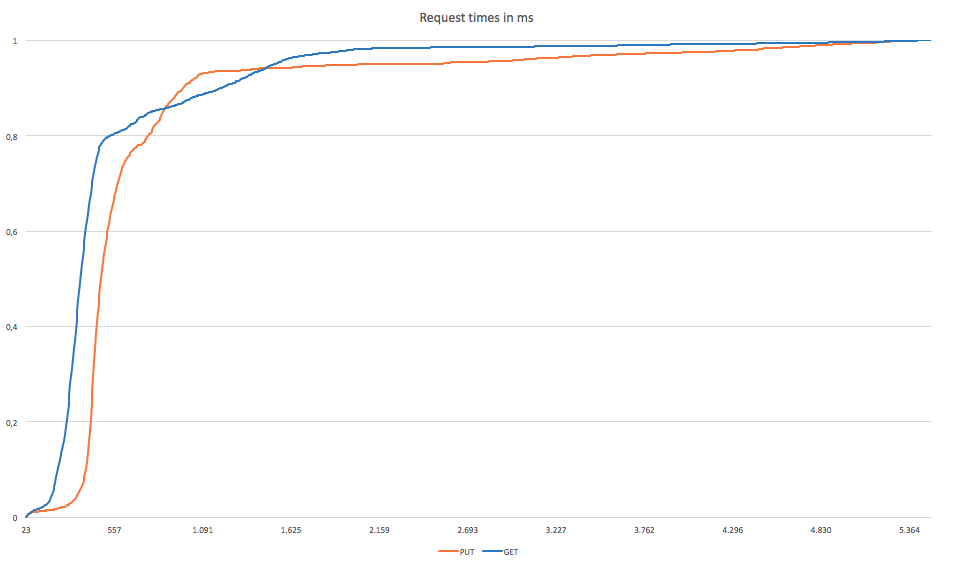

## Description of Component ##

The Global Registry is a decentralized directory service, linking globally unique user identifiers (GUIDs) to a list of user accounts owned by a user.
By resolving a GUID, services can retrieve information about the existence and location of all registeres user accounts for a specific user and connect to the respective account's Domain Registry.
The Global Registry is built in Java using Spring Boot and relys on decentralized control by utinizing DHT technology.

## Methodology and setup ##

For the evaluation of the Global Registry, three separate nodes were set up and connected to each other as described in the [installation manual](https://github.com/reTHINK-project/dev-registry-global/blob/master/docs/install.md).
Each node consisted of a virtual server managed by VMware with 1 CPU, 1 GB of RAM, and 10 GB of disk space.
The used operating system was Debian Jessie with a 3.16.0 kernel, while the Global Registry daemon was dockerized using Docker 17.03.1-ce.

## Performance metrics ##

The conducted tests evaluate the performance of the Global Registry network unter high load. For this, JMeter was used to simulate multiple clients (100 threads) to access the service simultaneously.
To keep the computational overhead of creating and signing datasets at a minimum, 4000 individual datasets were created in an offline-phase and saved to a database table. In the online phase, all datasets were read from the database and sent to the Global Registry and accessed again afterwards. Here, depending on the task, up to 340 (retrieving datasets via GET) and 120 (writing datasets via PUT) server hits per second were performed.

Figure 1: Elapsed times of GET and PUT requests in ms

When resolving a GUID, the service performed well with an average response time of 533ms with a median of 351ms. Anyhow, response times could be much higher, where a maximum value of more than 5492 ms was measured. The fastest response took only 23ms to complete.
For writing datasets, an average response time of 1777ms was measured with a median value of 1174ms. The increased duration of PUT requests can be explained by the overhead required to write data to the DHT. Worst observed time for a PUT request was 13873ms, where the best was 25ms.

## Conclusions and recommendations ##

While the Global Registry is a central component of the ReThink architecture, write requests are assumed to occur rarely compared to resolving existing identifiers. With Kademlia as a basis for the underlying DHT architecture, GET requests are ansered quickly with a median value of 351ms.
Writing performance was rather slow with a median value of 1174ms, but is thought to have no serious impact, as frequent updates to one's user accounts will only occur in the Domain Registy services, while the Global Registry will only be updated seldomly.
To further increase performance and to stabalize the service, the service should be run on performant hardware. As the Global Registry was tested on virtual machines, limitations of processing power and RAM showed.
